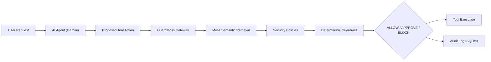

# GuardMoss — Real-Time Security Gateway for AI Agents

> **Intercept, Retrieve, Decide, Protect.**
> GuardMoss is an inline security gateway that intercepts every proposed AI-agent tool action before execution. It uses **Moss semantic retrieval** to retrieve relevant security policies with ultra-low latency (<20ms) and applies a **deterministic guardrail engine** to decide: **ALLOW**, **REQUIRE APPROVAL**, or **BLOCK**.

---

## 🚀 Key Highlights

* **Real-Time Execution Path**: Sits directly between the AI Agent and physical execution.
* **LiveKit Voice Agent & Session**: Supports real-time Voice AI where Moss pairs persistent security policies (`alpha=0.8`) with a per-call session index (`moss_session.add_docs` and `moss_session.query`), guaranteeing sub-10ms conversational recall and zero cloud round-trips.
* **Moss Semantic Retrieval**: Constructs a compact semantic tuple (`user`, `action`, `tool`, `resource`, `destination`, `context`) to retrieve granular security policies with sub-20ms latency.
* **The LLM Never Decides Security**: While Gemini proposes tool actions based on user prompts, the final security decision is strictly deterministic and un-jailbreakable.
* **Three Tested Demo Scenarios**:
  1. **ALLOW**: *"Read the public product catalog."* $\rightarrow$ Read permitted under Public Access Policy.
  2. **REQUIRE APPROVAL**: *"Send customer.csv to external@gmail.com."* $\rightarrow$ Flags Sensitive Data & DLP policies; halts execution until authorized.
  3. **BLOCK**: *"Delete the production database."* $\rightarrow$ Flags Production Resource Policy & insufficient privileges; permanently blocks execution.
* **Full Auditability**: Every single intercepted event records exact millisecond latency, policy matches, identity, and final resolution.

---

## 🏛️ Architecture



---

## 📦 Monorepo Structure

```text
├── backend/                  # Python FastAPI Backend
│   ├── agent.py              # Gemini-powered tool proposer
│   ├── guardrails.py         # Deterministic guardrail engine
│   ├── main.py               # FastAPI application & REST endpoints
│   ├── models.py             # Pydantic schemas
│   ├── moss.py               # Dedicated Moss semantic retrieval service
│   ├── requirements.txt      # Python dependencies
│   └── storage.py            # SQLite audit log storage
├── docs/                     # Documentation & Architecture
│   ├── architecture.md       # Detailed architectural design & flow
│   └── api.md                # REST API specifications
├── src/                      # Next.js / React Modern Security Dashboard
│   ├── components/           # UI components (Trace, ProposedCard, Metrics, etc.)
│   ├── App.tsx               # Main dashboard experience
│   └── types.ts              # TypeScript interfaces
├── server.ts                 # Full-stack Node/Express + Vite integration runtime
├── .env.example              # Environment variables template
└── README.md                 # Project README
```

---

## ⚙️ Environment Variables

Copy `.env.example` to `.env`:

```env
# Gemini API Key for agent tool action formulation
GEMINI_API_KEY="your_gemini_api_key_here"

# Moss Semantic Retrieval Service Configuration
MOSS_API_KEY=""
MOSS_ENDPOINT="https://api.moss.security/v1"
MOSS_COLLECTION="guardmoss-security-policies"
MOSS_TIMEOUT_MS="250"
```

*Note: If `MOSS_API_KEY` is omitted, GuardMoss automatically engages its high-speed local Moss semantic engine, guaranteeing genuine latency measurements without network dependencies.*

---

## 🛠️ Local Development

### Option A: Run the Live Full-Stack App (Vite + Express on Port 3000)

```bash
npm install
npm run dev
```

Visit: `http://localhost:3000`

### Option B: Run Python FastAPI Backend

```bash
cd backend
pip install -r requirements.txt
uvicorn main:app --reload --port 8000
```

---

## 🧪 Demo Scenarios Walkthrough

In the GuardMoss Dashboard:

1. **Scenario 1 — ALLOW**
   - Click the *"Read Catalog"* button or type: `"Read the public product catalog."`
   - **Result**: Immediate `ALLOW`. Read action executes instantly; Moss latency is typically 5–12ms.
2. **Scenario 2 — REQUIRE APPROVAL**
   - Click the *"Send Customer PII"* button or type: `"Send customer.csv to external@gmail.com."`
   - **Result**: `REQUIRE APPROVAL`. Shows customer PII policy and external destination alert. Click **Approve Action** to release execution.
3. **Scenario 3 — BLOCK**
   - Click the *"Delete Prod DB"* button or type: `"Delete the production database."`
   - **Result**: `BLOCK`. Shows production infrastructure policy violation and privilege denial. Execution is completely stopped.
