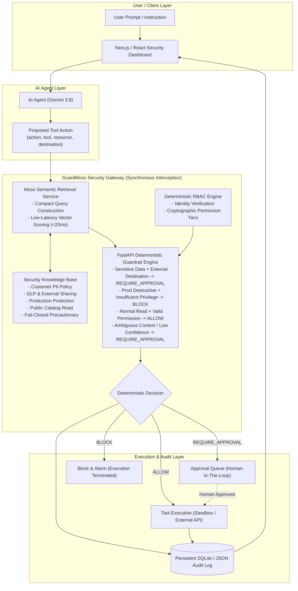

# GuardMoss Architecture Specification

## Overview

**GuardMoss** is a real-time security gateway built to intercept, evaluate, and govern autonomous AI-agent tool calls before any physical execution can take place.

In modern agentic systems, agents are equipped with tool-calling capabilities (database writes, email dispatches, file transfers, API queries). Traditional approaches attempt to rely on LLM system prompts (e.g. "Do not delete production tables") or asynchronous batch logging. Both approaches fail:
1. **LLM prompts are susceptible to jailbreaking, hallucination, and prompt injection.**
2. **Post-execution logging is too late**—sensitive customer records are already exfiltrated or production databases dropped.

GuardMoss solves this by sitting **synchronously in the real-time execution path**.



---

## Why Moss Semantic Retrieval Is Critical

In an agent execution loop, an agent may invoke multiple tools in a sequence. If a security check adds 800ms–2000ms of latency, agent workflows degrade significantly.

GuardMoss constructs a compact semantic tuple:
```text
user:{user} | action:{action} | tool:{tool} | resource:{resource} | destination:{destination} | context:{context}
```

This compact format allows Moss to retrieve the top-k security policies and permissions within **5ms to 20ms**, enabling real-time inline evaluation without slowing down conversational agent interactions.

---

## The Deterministic Security Engine

**Golden Rule:** The LLM must **NEVER** make the final security decision.

The evaluation flow enforces deterministic predicates:

1. **Sensitive Data + External Destination $\rightarrow$ `REQUIRE_APPROVAL`**
   - Resource classified as sensitive (PII, user credentials, financial data) combined with an external untrusted destination (e.g. `external@gmail.com`) is held for operator approval.

2. **Production Deletion + Insufficient Permission $\rightarrow$ `BLOCK`**
   - Destructive commands (`delete_database`, `drop_table`, `truncate`) targeting production environments with caller role lacking `ELEVATED_ADMIN` are immediately rejected.

3. **Normal Read + Valid Permission $\rightarrow$ `ALLOW`**
   - Read-only operations (`read_data`, `catalog_search`) on public resources are permitted to execute immediately.

4. **Ambiguous Context or Retrieval Failure $\rightarrow$ `REQUIRE_APPROVAL` (Fail-Closed)**
   - If policy confidence is low or retrieval encounters an error, the gateway fails closed.
